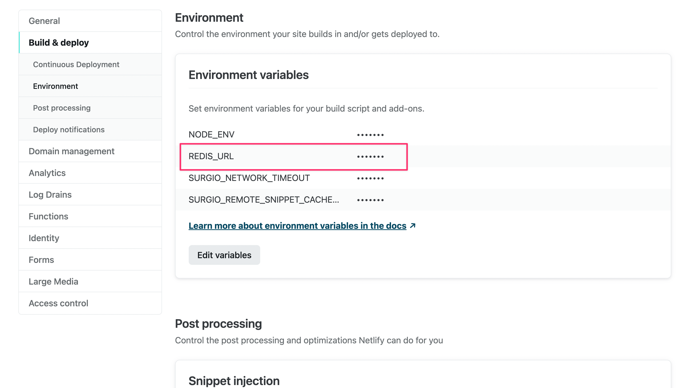

# 开启 Redis 缓存

如果你正在使用 API 网关，并且加入了多个订阅和远程片段，那么开启 Redis 缓存可以有效降低冷启动的时间。

原本的本地缓存实现方式是使用文件和内存缓存，但是这种方式存在一个问题，就是每次重新部署 Serverless 平台时，都会清空缓存。内存缓存甚至会在进程挂起时被清空。这就导致了冷启动时间变长。Redis 缓存因为运行在独立的进程中，所以不会受到这些影响。

## 新建一个免费的 Redis 实例

- [Redis Cloud](https://redis.com/try-free/)
- [Upstash](https://upstash.com/redis/)

上面这两个地方服务提供了额免费的 Redis 实例，性能已经完全满足 Surgio 的需求。你可以使用你自己的 Redis 数据库，只要能够从外网访问即可。

需要注意，假如你的 Surgio 服务部署在美西，那 Redis 也最好在美西。Railway 默认的部署区域是 `us-west-1`，Vercel 的默认部署区域是 `us-east-1`，Netlify 的默认部署区域是 `us-east-2`。

新建成功之后，上面的平台应该会提供一个连接地址，格式类似：

```
redis://:xxx...@some-thing-like-35533.upstash.io:35533
```

如果你开启了 TLS，则连接地址应该是：

```
rediss://:xxx...@some-thing-like-35533.upstash.io:35533
```

## 配置 Redis

### 在所有环境下开启

```js
// surgio.conf.js

module.exports = {
  cache: {
    type: 'redis',
    redisUrl: 'redis://:xxx...@some-thing-like-35533.upstash.io:35533',
  },
}
```

### 仅在部分环境下开启

请在需要开启 Redis 的环境下配置环境变量 `REDIS_URL`。不建议在本地生成配置时也连接 Redis，这样反而会变慢。

```js
// surgio.conf.js

module.exports = {
  cache: process.env.REDIS_URL
    ? {
      type: 'redis',
      redisUrl: process.env.REDIS_URL,
    }
    : undefined,
}
```

以 Netlify 为例，你可以在后台下图位置增加环境变量。


