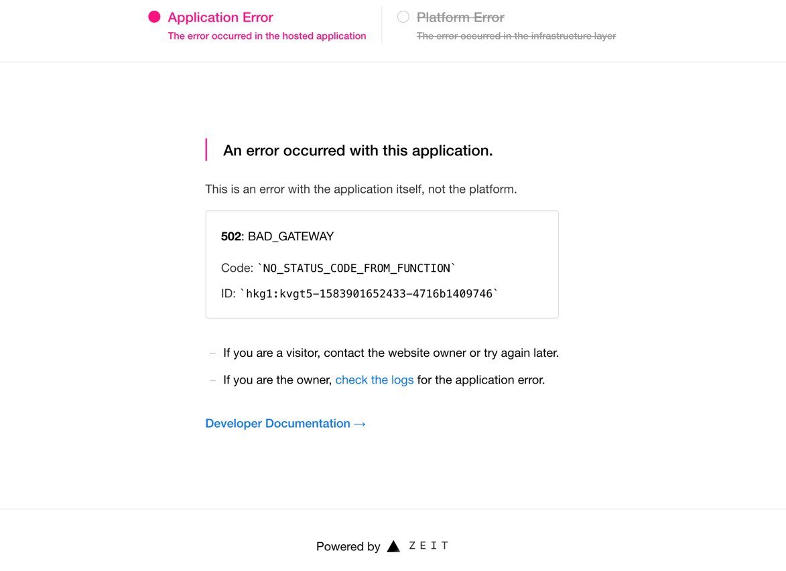

# 常见问题

## 本地生成规则时出现 `RequestError: connect ECONNREFUSED`

命令行默认不会通过代理请求，请在命令行内运行如下代码重试。端口号请根据自己的情况进行更改。

```bash
export https_proxy=http://127.0.0.1:6152;export http_proxy=http://127.0.0.1:6152;export all_proxy=socks5://127.0.0.1:6153
```

## 安装依赖时出现 `[warn]` 日志

可以忽略。

## 访问 now.sh 后报错



点击 _check the logs_，可以看到错误日志，截图后反馈至交流群。

Build logs 通常不会出错，如果没有看到错误请在 Functions 页面查看运行期错误。


